<div align="center">

<!-- Animated terminal hero: pure SVG/CSS animation with reduced-motion fallback. -->


<p><strong>Kitna Mahardika Favian</strong> — Fullstack Developer focused on building practical, reliable, and user-centered software.</p>

<p>
  <a href="https://www.linkedin.com/in/kitna-mahardika-favian-77801729b/"></a>
  <a href="mailto:kitnaradengandasklh@gmail.com"></a>
  <a href="https://kitnamf.my.id"></a>
  <a href="https://instagram.com/kittn.fv"></a>
</p>

</div>

### ⚡ Quick Bio

```elixir
defmodule Profile do
  def info do
    %{
      name: "Kitna Mahardika Favian",
      education: "Software Engineering — SMKN 1 Cimahi",
      graduation_score: 90.62,
      role: "Fullstack Developer",
      experience: "Citia Engineering Indonesia",
      focus: "Building practical and reliable software",
      goal: "Growing as a professional fullstack developer"
    }
  end
end
```

### 🛠️ Tech Stack

| Category | Technologies |
| :--- | :--- |
| **Languages** |     |
| **Frontend** |      |
| **Backend** |     |
| **Mobile** |     |
| **Database** |      |

### 🚀 Featured Projects

<div align="center">

`build` → `test` → `learn` → `ship` &nbsp;·&nbsp; `09 builds` &nbsp;·&nbsp; `04 public links`

</div>

> A focused selection of systems, experiments, and products. Public links are marked with `↗`; private and local work is intentionally shown without repository links.

#### 🧠 Intelligence & Impact

<details open>
<summary><strong>01 · HoaxHunter</strong> &nbsp; <code>🟡 LOCAL PROTOTYPE</code> <code>AI + COMMUNITY</code></summary>

AI-assisted fact-checking for Indonesian users. Submit a URL, screenshot, or text and turn a messy claim into a structured, source-grounded verdict.

`Next.js` · `NestJS` · `Supabase` · `Prisma` · `Gemini`

</details>

<details>
<summary><strong>02 · IHSG Bandarmology</strong> &nbsp; <code>🟡 LOCAL PROTOTYPE</code> <code>DATA PIPELINE</code></summary>

IDX stock-screening dashboard built around real market data, OHLCV processing, news sentiment, scoring, and a Supabase-backed frontend.

`Python` · `Next.js` · `Pandas` · `Supabase`

</details>

<details>
<summary><strong>03 · EcoVerse / Evorin</strong> &nbsp; <code>🔒 PRIVATE BUILD</code> <code>SMART RECYCLING</code></summary>

Smart recycling ecosystem that turns bottle detection into EcoPoints through an AI camera, dashboard, QR flow, mobile app, and rewards history.

`YOLOv8` · `Flutter` · `Node.js` · `MySQL`

</details>

#### 📱 Product & Mobile

<details open>
<summary><a href="https://github.com/KittodGG/Bitichil"><strong>04 · ₿ Bitichil ↗</strong></a> &nbsp; <code>🟢 PUBLIC REPOSITORY</code> <code>FINTECH MOBILE</code></summary>

Bitcoin savings tracker for couples with Firebase authentication, market data, charts, and finance-focused mobile interactions.

`React Native` · `Expo` · `Firebase` · `Indodax API`

</details>

<details>
<summary><a href="https://github.com/KittodGG/Glaze"><strong>05 · ✨ Glaze ↗</strong></a> &nbsp; <code>🟢 PUBLIC REPOSITORY</code> <code>MOBILE EXPERIMENT</code></summary>

Mobile application experiment focused on refined UI, responsive navigation, AI-assisted features, and a consistent component system.

`React Native` · `Expo` · `Gemini` · `Firebase` · `Zustand`

</details>

<details>
<summary><a href="https://github.com/KittodGG/SIAGA-Sistem-Indikator-Alarm-Gas-Aktif-"><strong>06 · 🚨 SIAGA ↗</strong></a> &nbsp; <code>🟢 PUBLIC REPOSITORY</code> <code>IoT ALERT</code></summary>

Gas-alert indicator built around an ESP8266 and MQ-02 sensor, with WhatsApp notifications when gas levels exceed the configured threshold.

`ESP8266` · `MQ-02` · `IoT` · `WhatsApp`

</details>

#### 🧱 Fullstack Systems & Craft

<details open>
<summary><strong>07 · WidgetPorto</strong> &nbsp; <code>🟡 LOCAL PROTOTYPE</code> <code>REST API</code></summary>

NestJS REST API for a shadow portfolio tracker covering authentication, holdings, market status, fee calculation, sparkline data, and scheduled price polling.

`NestJS` · `TypeScript` · `PostgreSQL` · `Prisma`

</details>

<details>
<summary><strong>08 · CitiaCashflow / Rev-CM</strong> &nbsp; <code>🔒 PRIVATE BUILD</code> <code>FULLSTACK FINANCE</code></summary>

Fullstack financial platform for structured cash-flow management with a focus on clear UI, reliable backend architecture, and maintainable data access.

`Next.js` · `NestJS` · `Prisma` · `PostgreSQL`

</details>

<details>
<summary><a href="https://kitnamf.my.id"><strong>09 · 🎞️ Personal Portfolio ↗</strong></a> &nbsp; <code>🔗 LIVE SITE</code> <code>CREATIVE FRONTEND</code></summary>

Interactive showcase and animation playground for motion, scrolling, and presentation of selected work.

`React` · `GSAP` · `Framer Motion` · `Lenis`

</details>

<div align="center">

<sub>🟡 Local prototype &nbsp;·&nbsp; 🔒 Private build &nbsp;·&nbsp; 🟢 Public repository &nbsp;·&nbsp; 🔗 Live site</sub>

</div>

### 📊 GitHub Stats

<p align="center"><sub>ACTIVITY OVERVIEW</sub></p>

<p align="center">
  
</p>

<p align="center"><sub>GITHUB STATS</sub>&nbsp;&nbsp;&nbsp;&nbsp;&nbsp;&nbsp;&nbsp;&nbsp;<sub>MOST USED LANGUAGES</sub></p>

<p align="center">
  
  
</p>

<p align="center">
  
</p>

---

<div align="center">
  
</div>
